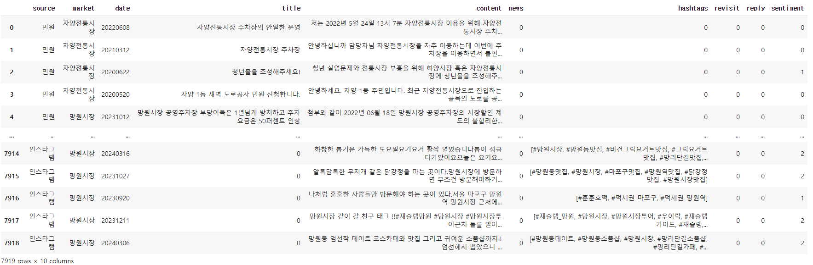
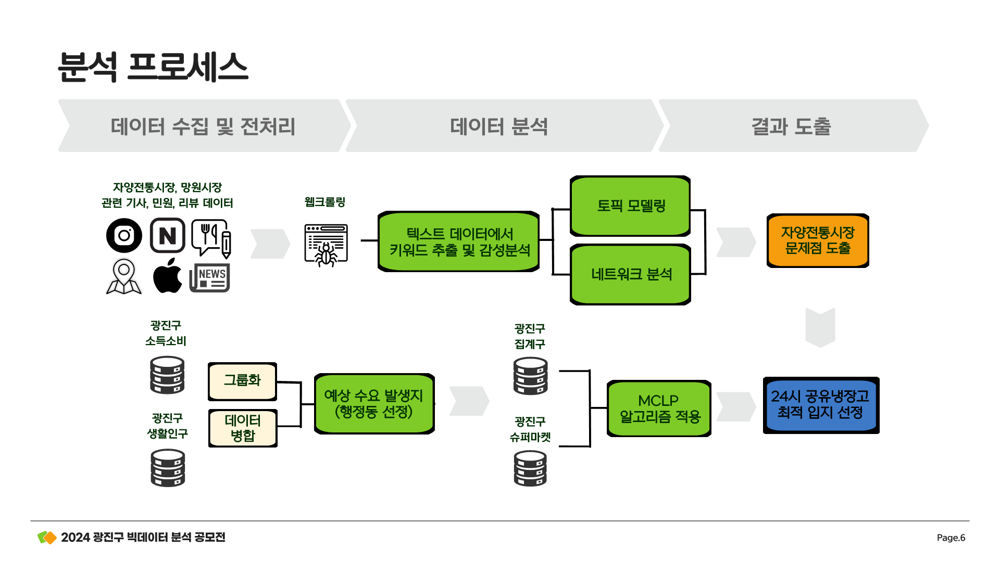

# :mag_right:언어 모델을 활용한 전통시장 문제점 분석:mag_right:

**2024 광진구 빅데이터 분석 공모전**

----------------------

## :book: 개요

### :dart:주제
서울 광진구의 전통시장을 분석하여 활성화 아이디어 도출

### :calendar:기간
2024.03.11 ~ 2024.04.30

### :busts_in_silhouette:참여 인원
4명

### :memo:역할
- 네이버 카페&인스타그램 게시물 크롤링
- 파인튜닝, keyword Network 및 MCLP 입지 선정, 지도 시각화

### :chart_with_upwards_trend:배경
- 타 지역 전통시장에 비해 활성화되지 않은 광진구의 전통시장(자양시장) 살리기에 주목

### :triangular_flag_on_post:목표
- 2030 단독세대 거주 비율이 매우 높은 지역 특성을 고려하여 기사, SNS, 어플 리뷰 등의 텍스트 데이터를 수집
- 언어모델로 리뷰 데이터를 분석해 전통시장의 문제점 파악

### :open_file_folder: 사용 데이터
> 웹크롤링 데이터, 생활인구 / 소득소비 / 집계구 데이터

### :bulb: 문제 정의
- 분석에 필요한 데이터 부족
- 전통시장 활성화를 위해서는 실제 시장을 이용하는 소비자들의 생생한 경험과 의견 분석이 요구됨

### :crown:성과
- 분석을 위한 데이터를 웹 크롤링을 통해 직접 수집
- 다양한 언어모델을 이용한 문제점 분석을 통해 아이디어 근거 제시

---------

## :chart_with_upwards_trend:분석 과정

1. 데이터 수집
- 네이버 카페, 블로그, 인스타그램, 구청 민원 데이터, 땡겨요 앱, 놀장 앱, 뉴스기사, 구글맵
- '자양전통시장', '망원시장' 검색어 기준으로 웹크롤링
- 약 8000개의 데이터 수집

2. 데이터 가공
- content를 중심으로 분석

  
3. 분석

